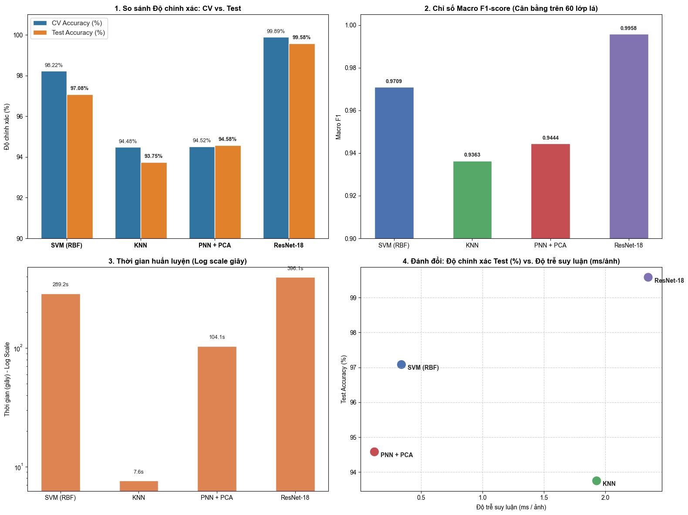

# 🍃 Foliage Leaf Species Recognition
### Handcrafted Features (Baseline PNN + PCA) vs. Deep Learning (ResNet-18)


Dự án nghiên cứu và đánh giá toàn diện bài toán **phân loại 60 loài lá cây** trên bộ dữ liệu Foliage Dataset. Hệ thống tái hiện phương pháp truyền thống trích xuất **57 đặc trưng thủ công** với mô hình cơ sở **PNN + PCA** theo nghiên cứu của Abdul Kadir et al. (2011), đồng thời so sánh trực tiếp với **SVM (RBF)**, **KNN** và mô hình học sâu **ResNet-18 (Transfer Learning)**.

---

## Table of Contents

- [Dataset](#-dataset)
- [Results](#-results)
- [Visualization](#-visualization)
- [Installation](#-installation)
- [Usage](#-usage)
- [Project Structure](#-project-structure)
- [References](#-references)

---

## Dataset

Bộ dữ liệu **Foliage Dataset** gồm **60 loài lá cây kiểng**, được chia thành:

| Split | Số mẫu | Số ảnh/loài |
|:---|:---:|:---:|
| Training | 6.000 | 100 |
| Testing-1 | 600 | 10 |
| Testing-2 | 600 | 10 |

> Tập Testing-1 và Testing-2 hoàn toàn độc lập với tập huấn luyện, được dùng để đánh giá ngoại kiểm (out-of-sample evaluation).

---

## Results

Tất cả mô hình được đánh giá trên **1.200 ảnh kiểm thử độc lập** (Testing-1 & Testing-2 gộp lại):

| Phân loại | Mô hình | Cấu hình tối ưu | Val Acc (%) | Test Acc (%) | Macro F1 | Train Time (s) | Latency (ms/img) |
|:---|:---|:---|:---:|:---:|:---:|:---:|:---:|
| Deep Learning | **ResNet-18** | Pretrained ImageNet, AdamW lr=1e-4, Cosine Annealing, 15 epochs | 99.89 | **99.58** | **0.9958** | 396.15 | 2.35 |
| Machine Learning | **SVM (RBF)** | PCA (n=40, whiten=True), C=10, γ=0.01 | 98.22 | 97.08 | 0.9709 | 289.16 | 0.34 |
| **Baseline** | **PNN + PCA** | PCA (n=50), σ=0.1 | 94.52 | 94.58 | 0.9444 | 104.10 | **0.12** |
| Machine Learning | **KNN** | PCA (n=57), k=7, distance weights | 94.48 | 93.75 | 0.9363 | 7.58 | 1.93 |

### 💡 Key Insights

- **ResNet-18** đạt độ chính xác **99.58%**, vượt trội nhờ tự động học đặc trưng không gian sâu thay vì 57 đặc trưng thủ công cố định.
- **SVM (RBF)** cải thiện **+2.50%** so với baseline PNN, cho thấy phân tách siêu phẳng phi tuyến hiệu quả hơn ước lượng mật độ xác suất trong không gian 60 lớp.
- **PNN + PCA** tái hiện thành công kết quả gốc của Abdul Kadir et al. (93.75% → 94.58%) và duy trì lợi thế **suy luận nhanh nhất** (0.12 ms/ảnh), phù hợp triển khai trên Edge AI / thiết bị nhúng không có GPU.

---

## Visualization

### Confusion Matrix & Per-class Performance



> Các biểu đồ chi tiết (confusion matrix, t-SNE, precision/recall từng loài) được lưu tại `reports/figures/`.

---

## ⚙️ Installation

```bash
# 1. Clone repository
git clone https://github.com/AlanTurning2005/foliage-leaf-recognition.git
cd foliage-leaf-recognition

python -m venv venv
source venv/bin/activate        # Linux/macOS
# venv\Scripts\activate         # Windows

# 3. Cài đặt dependencies
pip install -r requirements.txt
```

**Yêu cầu:** Python 3.9+, CUDA

---

## Usage

Chạy lần lượt các notebook theo thứ tự sau:

### Bước 1 — Trích xuất đặc trưng
Chạy script trích xuất trực tiếp bằng Terminal / CMD tại thư mục gốc của project:
```bash
python scripts/run_extraction.py
```
Trích xuất 57 đặc trưng thủ công (PFT, Geometric, Color Moments, Vein, Texture) từ ảnh gốc `.tif`. Output: `data/processed/df_dataset.csv`, `df_testing_1.csv`, `df_testing_2.csv`.

### Bước 2 — Phân tích khám phá dữ liệu
```bash
jupyter notebook notebooks/01_eda_and_check.ipynb
```
Trực quan hóa phân phối đặc trưng, tương quan giữa các lớp, và giảm chiều t-SNE 2D.

### Bước 3 — Huấn luyện mô hình ML (Baseline + SVM + KNN)
```bash
python scripts/train_classical.py
```
Huấn luyện và đánh giá PNN + PCA (baseline), SVM (RBF), KNN. Lưu kết quả vào `reports/metrics_summary.csv`.

### Bước 4 — Huấn luyện ResNet-18
```bash
jupyter notebook scripts/train_cnn.ipynb
```

### Bước 5 - Tổng hợp & So sánh kết quả
```bash
jupyter notebook notebooks/02_compare_models.ipynb
```
---

## Project Structure

```
Project_leaves_recognition/
├── configs/
│   └── config.py                   # Định nghĩa 57 tên đặc trưng, hằng số và danh sách nhãn
├── data/
│   ├── raw/                        # Thư mục chứa dữ liệu ảnh gốc .tif (tùy chọn)
│   └── processed/                  # Bảng dữ liệu vector đặc trưng dạng CSV
│       ├── df_dataset.csv          # Dữ liệu huấn luyện (6.000 mẫu x 60 loài)
│       ├── df_testing_1.csv        # Ngoại kiểm độc lập 1 (600 mẫu)
│       └── df_testing_2.csv        # Ngoại kiểm độc lập 2 (600 mẫu)
├── notebooks/
│   ├── 01_eda_and_check.ipynb      # EDA, kiểm tra dữ liệu hình học, màu sắc và t-SNE
│   └── 02_compare_models.ipynb     # Đọc metrics, phân tích so sánh và vẽ biểu đồ các model
├── scripts/
│   ├── run_extraction.py           # CMD script trích xuất 57 đặc trưng thủ công
│   ├── train_classical.py          # CMD script huấn luyện & Grid Search Baseline PNN, SVM, KNN
│   └── train_cnn.ipynb             # Notebook huấn luyện ResNet-18 qua 15 epochs (Kaggle)
├── reports/
│   ├── cv_result.csv               # Chi tiết kết quả kiểm định chéo các mô hình ML
│   ├── metrics_summary.csv         # Bảng tổng hợp chỉ số hiệu năng (Accuracy, Latency,...)
│   ├── per_class_metrics.csv       # Chi tiết Precision/Recall từng lớp của ML
│   ├── resnet_metrics.csv          # Kết quả đánh giá của mô hình ResNet-18
│   ├── resnet_per_class.csv        # Đánh giá chi tiết 60 lớp của ResNet-18
│   └── figures/                    # Nơi lưu trữ biểu đồ xuất ra phục vụ báo cáo
├── requirements.txt                # Danh sách thư viện cần thiết
├── .gitignore                      # Loại trừ dữ liệu ảnh thô và checkpoint nặng
└── README.md
```

---

## References

1. Abdul Kadir, L. E. Nugroho, A. Susanto, P. I. Santosa (2011). *Leaf Classification Using Shape, Color, and Texture Features*. International Journal of Computer Trends and Technology (IJCTT), pp. 225–230.

2. S. G. Wu, F. S. Bao, E. Y. Xu, Y.-X. Wang, Y.-F. Chang, Q.-L. Xiang (2007). *A Leaf Recognition Algorithm for Plant Classification Using Probabilistic Neural Network*. IEEE 7th International Symposium on Signal Processing and Information Technology (ISSPIT).

3. B. M. Quach, D. V. Cuong, N. Pham, D. Huynh, B. T. Nguyen (2020). *Leaf Recognition Using Convolutional Neural Networks Based Features*. Applied Intelligence.